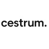
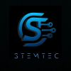
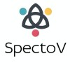
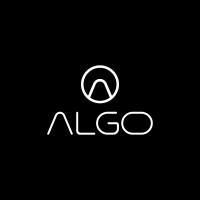

  

B.Tech student at VIT Chennai, building at the intersection of autonomous robotics, edge AI, and assistive technology platforms.

I engineer EKF-fused multi-sensor localization stacks for indoor autonomous platforms, deploy quantized CV models on resource-constrained edge hardware, and architect real-time sign language recognition systems from dataset curation through on-device inference. My work spans ROS2-based SLAM pipelines, assistive wearables with RGB-D and IMU fusion, autonomous surveillance drones, and full-stack MERN web applications — each built to function under real hardware constraints and production latency requirements.

**21 Patents Filed/Issued &nbsp;·&nbsp; ₹6.45L+ in Research Grants &nbsp;·&nbsp; SIH '25 National Finalist &nbsp;·&nbsp; Techgium® Top 7 / 62K+ &nbsp;·&nbsp; IRoC Top ~100 / 5K**

| Robotics &amp; Perception | AI &amp; Edge Systems | Full-Stack &amp; Embedded |
| :--- | :--- | :--- |
| SLAM (SLAM Toolbox) &amp; loop-closure tuning | On-device CV: YOLO, MediaPipe, pose estimation | MERN stack production web applications |
| EKF multi-sensor fusion at production Hz | Model quantization for edge inference | RESTful API design with Express.js |
| ROS2 architecture &amp; driver integration | Sign language recognition (ISL/ASL) pipelines | React component architecture &amp; state design |
| Visual-Inertial Odometry (VINS-Fusion) | Dataset curation &amp; training pipeline design | MongoDB schema &amp; backend logic |
| LiDAR, RGB-D &amp; IMU sensor fusion | Real-time inference on Jetson &amp; Raspberry Pi | NVIDIA Jetson Orin &amp; Raspberry Pi deployment |
| Autonomous navigation &amp; obstacle avoidance | Scene awareness &amp; contextual AI systems | ESP32 &amp; Arduino embedded firmware |
| Rocker-bogie &amp; multi-terrain rover design | Assistive wearable AI architecture | Micro-OLED HUD &amp; wearable hardware integration |
| Quadcopter SLAM &amp; GPS-denied navigation | Audio + vision multimodal system design | Sensor data pipelines &amp; real-time processing |

 

 

`ROS2` &nbsp; `SLAM` &nbsp; `EKF Fusion` &nbsp; `YOLO` &nbsp; `MediaPipe` &nbsp; `VIO` &nbsp; `VINS-Fusion` &nbsp; `Edge AI` &nbsp; `ISL/ASL` &nbsp; `Sensor Fusion` &nbsp; `PyTorch` &nbsp; `OpenCV` &nbsp; `MERN`

### [ 01 // RECOGNITION ]

| National Competitions | Regional &amp; University Hackathons |
| :--- | :--- |
| **LTTS TECHgium®** &nbsp;  | **Schrödinger's Cat Hackathon (SRM AP)** &nbsp;  |
| **Smart India Hackathon 2025** &nbsp;  | **E-Codeathon 2026 (VIT Chennai)** &nbsp;  |
| **ISRO Robotics Challenge '25** &nbsp;  | **Innovate for Impact** &nbsp;  |
| **ISRO Robotics Challenge '24** &nbsp;  | **Pragyan '24 — Ingenium Hackathon (NIT Trichy)** &nbsp;  |

### [ 02 // RESEARCH &amp; INTELLECTUAL PROPERTY ]

| Intellectual Property | Design Innovations | Registry |
| :--- | :--- | :---: |
| **20 Utility Patents**   Filed/Issued across AI-driven systems, computer vision, embedded technologies, and assistive hardware | **1 Design Patent**   Filed for the Terrain Scout multi-operational defence rover |  |

 

<strong>📋 All 21 Patents (click to expand)</strong>

 

| # | Title |
|:-:|:------|
| 01 | [System and Method for Operating Hand Gesture-Based Kiosk](https://drive.google.com/file/d/1CPxZzMb7vvRisHpmLzMKeg_vueh5Ws2v/view) |
| 02 | [Wearable Device for Fall Prediction Using Orientation Calibration and Motion Sensing](https://drive.google.com/file/d/1EoKo2kLAlnN89TRRF6CCarsSYNfX0Qt6/view) |
| 03 | [Autonomous Vehicle for Environmental Monitoring and Infrastructure Inspection](https://drive.google.com/file/d/17AORsw9jktqkuwX2ADiO6XF-yvz_fUGd/view) |
| 04 | [Retrofittable System and Method for Energy Harvesting, Biomechanical Analytics, and Adaptive Training in Exercise Equipment](https://drive.google.com/file/d/1Mbw0hQ18ci5zyIHvT4vWFC24bmduVisV/view) |
| 05 | [Smart Autonomous Dustbin System for Cleaning and Waste Segregation](https://drive.google.com/file/d/14IId4WeXfhwACCpzgLC1lbcda6MkqMyF/view) |
| 06 | [An Infant Cradle Device](https://drive.google.com/file/d/1x4j-qRUYNtfkJXBzbUsvAQN82K_yCkIY/view) |
| 07 | [Retrofittable Dip-Type Multi-Spectral Sensor System for Real-Time Food Analysis](https://drive.google.com/file/d/1N6Bywqj0KwB8cBrOe5HQxFGtv-VveSKT/view) |
| 08 | [Wearable System for Predicting & Managing Body-Focused Repetitive Behavior (BFRB)](https://drive.google.com/file/d/15Zzb3sPhcQmLw4M2nXiuQxDJyM5aTv2q/view) |
| 09 | [System and Method for Selective Audio Capture and Processing](https://drive.google.com/file/d/1LGIMFz0GtB7UJJ4WwqIl8xVTw_MsDo3f/view) |
| 10 | [System and Method for Radiation Mapping in Hazardous Environments](https://drive.google.com/file/d/1a5IAwgrdtPIw4ENmnKA9AtVdaMh0zgYa/view) |
| 11 | [Apparatus and Method for Automatic Medicine Dispensing](https://drive.google.com/file/d/1ZgNP9iV1C8o7dMSKctsg9uKn7t9LwGf8/view) |
| 12 | [Navigation Assistance System for the Visually Impaired](https://drive.google.com/file/d/16YlZeFuseiz4nhdfkjdVB8TN0GOiq_x2/view) |
| 13 | [System and Method for Deploying an Aerial Communication Network](https://drive.google.com/file/d/1DtkaXDcbHD0A29tmIxCDL9m4NSXCqzl7/view) |
| 14 | [System to Circulate Information in Educational Campus](https://drive.google.com/file/d/1XqNCiN6B8IKw2QaiiVacWpUOEbsNE3d1/view) |
| 15 | [System and Method of Fabric Durability Assessment](https://drive.google.com/file/d/1GDThuhus87DviBFfW3nxPA-Y0vN9weZq/view) |
| 16 | [Autonomous Detection, Extraction & Treatment of Foam from Water Surface](https://drive.google.com/file/d/1f-EWsGTJEfNv_RtWHN8OwDmBvOOMzuWV/view) |
| 17 | [Modular Smart Eyewear for Breathing Assistance and Temple Massage](https://drive.google.com/file/d/1ESrxrJUxhK6Um3-iuE6ac3vC9YdBowwf/view) |
| 18 | [Retrofittable Vehicle Control System for Command-Based Operation](https://drive.google.com/file/d/1_FlcTPJFMtgnUWwJKkY8KA5cLLKrrlNgB/view) |
| 19 | [Calibration Apparatus and Method Thereof](https://drive.google.com/file/d/18KsxeTLleVaidtA6TL7iIixa_EddCOSA/view) |
| 20 | [Adaptive Modular Robotic System for Search and Rescue Operations](https://drive.google.com/file/d/1d4tNxUDk2urr9n-3_pSt5_lPuCAXCs5t/view) |
| 21 | [Defence Rover: Terrain Scout *(Design Patent)*](https://drive.google.com/file/d/1qqsEQgbDlMflW9pmhXs7p6vs29bn_GGG/view) |

| Currently Building | Active Research &amp; Exploration |
| :--- | :--- |
| - ISL/ASL real-time recognition for on-device wearables | - VINS-Fusion + MAVLink pose injection for PX4 drones |
| - VORTEX — autonomous multi-terrain rover platform (ROS2) | - ONNX export for cross-platform edge deployment |
| - SPARC — edge AI assistive wearable for deaf/mute communities | - Transformer-based architectures for sign language sequence modeling |
| - Autonomous surveillance &amp; delivery drone systems | - Multi-spectral sensing pipelines for real-time analysis |
| - EKF-fused SLAM for GPS-denied indoor navigation | - LiDAR-camera calibration for high-resolution mapping |

### [ 03 // WORK EXPERIENCE ]

#### Cestrum &nbsp;·&nbsp; Head of AI
`Sep 2025 – Present` &nbsp;·&nbsp; `PyTorch` · `ISL/ASL Recognition` · `Edge Inference` · `Dataset Curation`

Leading AI development for audio- and vision-based sign language systems · Directing model training pipelines, dataset curation, and real-time edge inference optimization · Managing the core AI &amp; Data Science team

 

#### Trans Bharat Aviation &nbsp;·&nbsp; Aviation (UAV) & MRO Intern
`May – Jul 2026` &nbsp;·&nbsp; `UAV Flight Ops` · `Helicopter Fleet` · `MRO` · `Airworthiness Compliance` · `Quality Control`

Supported UAV flight operations and pre-flight testing alongside helicopter fleet MRO planning in a live hangar environment · Reviewed technical documentation for airworthiness compliance across UAV and helicopter assets · Tracked rotable-component inventory and applied quality control and regulatory standards during fleet inspections

 

#### Stemtec AI and Robotics Pvt Ltd &nbsp;·&nbsp; AI &amp; Robotics Intern
`Dec 2025 – Jan 2026` &nbsp;·&nbsp; `ROS2` · `SLAM Toolbox` · `EKF` · `Python` · `C++`

Built STEMBOT autonomous navigation system using ROS2 · SLAM pipeline at 0.05m resolution with 92% loop-closure accuracy · EKF multi-sensor fusion reducing localization drift by 50% · Obstacle avoidance with 95% success rate

 

#### SpectoV Assistive Technologies &nbsp;·&nbsp; Product Development Intern
`May – Jul 2025` &nbsp;·&nbsp; `Python` · `YOLO` · `OpenCV` · `TensorFlow` · `Raspberry Pi` · `Sensor Fusion`

Designed hybrid assistive wearable combining sign language recognition and contextual scene awareness · Curated 12,000+ image dataset across 42 classes · Achieved ~370ms ASL latency via model quantization on Raspberry Pi · Integrated RGB-D cameras, IMU, and micro-OLED HUDs

 

#### Algo Technologies Pvt. Ltd. &nbsp;·&nbsp; Software Developer Intern
`May – Jun 2025` &nbsp;·&nbsp; `MongoDB` · `Express.js` · `React.js` · `Node.js`

Built and enhanced production MERN stack web applications · Designed RESTful API endpoints and reusable React component architecture · Contributed to scalable backend logic and MongoDB schema design

 

#### VIT Chennai &nbsp;·&nbsp; Summer Research Intern
`Jul 2024` &nbsp;·&nbsp; `YOLO` · `OpenCV` · `Python` · `Pose Estimation`

Developed real-time object detection and human pose estimation pipelines for CCTV security networks

 

 

&nbsp;

&nbsp;

 

